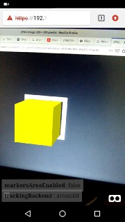

# Augemented Reality in 5 minutes

# Steps

## 1.- Generate a self signed certificate

```
openssl req -x509 -newkey rsa:4096 -keyout server1.example.com.key -out server1.example.com.pem -days 365 -nodes
```

This will create **server1.example.com.key** and **server1.example.com.pem** in your folder.

## 2.- Load certificates in server.py

Modify lines 10 - 11, pointing to the absolute path of your \*.pem and \*.key and choose some port line 9

## 3.- Start mini server

Make executable to your server.py

```
chmod +x server.py
```

And run it:

```
./server.py
```

> source: https://jorge.fbarr.net/2017/06/11/simplehttpserver-with-ssl/

## 4.- Open in your smartphone, tablet or whatever

If your ip is 192.168.1.150 and your chosen port is 5000, open in your device :

https://192.168.1.150:5000

And grant camera permissions.

## 5.- Let's start the magic

If the previous url was loaded without errors, point your camera to this image


And a yellow cube will appear:



That's All!
